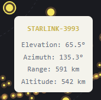

# Overpass

A real-time satellite tracker that shows which satellites are passing overhead at your location, plotted on a circular sky map.

<!-- Screenshot of the sky map -->


## Live Demo

[pblood66.github.io/overpass](https://pblood66.github.io/SatOnTheHat/)

---

## What It Does

Overpass reads TLE (Two-Line Element) orbital data, propagates each satellite's position using the SGP4 algorithm, and filters for satellites currently above 10° elevation at your GPS location. Those satellites appear as dots on a radar-style sky view — center is directly overhead, edge is the horizon, and dot size reflects how close the satellite is to you.

<!-- Screenshot of a satellite tooltip on hover -->


Hover any dot to see the satellite's name, elevation, azimuth, range, and altitude.

---

## Stack

- **React + Vite + TypeScript**
- **satellite.js** — SGP4/SDP4 orbital propagation and look angle calculation
- **React Router** — client-side routing
- **Canvas API** — sky map rendering with a two-layer approach for smooth hover interaction
- **TLE data** — sourced from [Celestrak](https://celestrak.org)

---

## How It Works

1. TLE data loads from `public/data/sat-data.txt` on startup
2. `usePosition` watches the browser geolocation API for your coordinates
3. `useOverheadPass` runs every second, propagating every satellite and computing look angles relative to your position
4. Satellites above 10° elevation get plotted on the sky map by azimuth and elevation

---

## Routes

| Path | Page |
|------|------|
| `/` | Sky map |
| `/debug` | Debug view — shows GPS status, satellite count, and a list of overhead passes |

---

## Running Locally

```bash
git clone https://github.com/pblood66/SatOnTheHat.git
cd SatOnTheHat
npm install
npm run dev
```

The app will prompt for location access on first load. TLE data is bundled locally so no external API calls are needed at runtime.

---

## Updating Satellite Data

Download fresh TLE data from Celestrak and replace `public/data/sat-data.txt`:

```
https://celestrak.org/SATCAT/tle.php?GROUP=visual&FORMAT=tle
```

Celestrak updates their catalog several times a day. TLE data older than a few days will produce less accurate positions.

---
